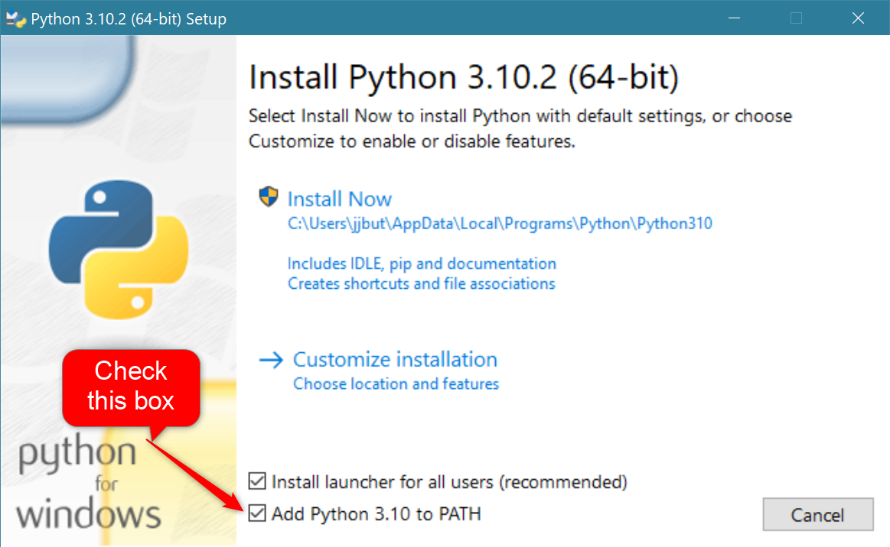
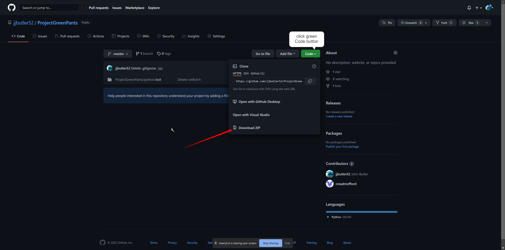

# ProjectGreenPants
Dice Rolling Bot for playing Warhammer Fantasy Role Playing 4th Ed (WFRP)

**[Link to Warhammer site](https://www.cubicle7games.com/our-games/warhammer-fantasy-roleplay/)**

<a brief but clear understanding of why someone should be interested>
Want to play Warhammer Fantasy RPG with remote friends in a telegram chat?
For example, you can attack, defend, use a skill etc…

<how do I set this up>

## Summary
It's free to run your own bot for your games.  Only one person needs to setup the bot and everyone else just needs a telegram account and a private telegram chat with the bot and all members.
	
## Bot Usage
type "/h" to get a list of available commands
	
attack usage: /a >skill< - Where >skill< is your weapon skill + any combat modifiers
					   
defend usage: /d >skill< - Where >skill< is your weapon skill + any combat modifiers
## Setup Instructions
This will be simple to setup just following the directions below:

all users:
	- install telegram
	- create/join private group chat

one user:

	1. install telegram: https://desktop.telegram.org/ 
	(this also works on all mobile devices, pcs, tables that support telegram)

	2. create a private bot and a token by going here (takes 2 minutes or less):
	https://core.telegram.org/bots#6-botfather/
	this will create and return a token in 2 minutes or less:  110201543:AAHdqTcvCH1vGWJxfSeofSAs0K5PALDsaw  <- SAMPLE TOKEN
	DO NOT SHARE YOUR PRIVATE TOKEN WITH ANYONE!!!
	Save the bots name somewhere so you don't forget it (just write it down for now)

	(background info on telegram bots: https://core.telegram.org/bots)

	3. install python 
**[link](https://www.python.org/downloads/) for python download.**
		

		
	Choose Install Now option.
	Check box to Add Python 3.xx to PATH
	
	4. install python-telegram-bot package
	Open windows command prompt (type "CMD" into windows taskbar search)
	From command prompt type "pip install python-telegram-bot"

	5. Create an environment variable
	From command prompt type "setx GPR_BOT_TOKEN <YOUR TOKEN HERE>"
	Example: "setx GPR_BOT_TOKEN 110201543:AAHdqTcvCH1vGWJxfSeofSAs0K5PALDsaw"
	Note: there is a space after GPR_BOT_TOKEN

	6. Download the app
**[link](https://github.com/jjbutler52/ProjectGreenPants) to the github repository**
		

	
	click on the green button(Code)
	Click the option to download the zip file
	Store this zip file in a location on our computer that you can navigate to easily (Ex: C:\GPRscript)
	Extract the files
	
	7. Go to Telegram app and create a private group
	Click on the 3 horizontal lines in the upper left corner
	Then click on New Group
	Add all of your friends and then add your bot as you would another member (this will be name of the bot created in step 2)
		
	8.  Run the bot when you are going to play your game with friends
	Open Command Prompt from Windows (CMD from the tash search bar) navigate to the directory where you saved the script
	Type "python gprbot.py"
	
